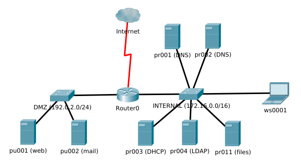

# Assignment Enterprise Linux: SME infrastructure

- Student: NAME
- Repository: https://github/com/USER/REPO

The goal of this assignment is to set up the infrastructure for a Small/Medium Enterprise (SME) in a virtualized environment using the [Ansible](https://ansible.com/) configuration management system. When you're finished, you should be able to recreate the entire infrastructure *from scratch* using a minimum of manual interventions, ideally a single command (`vagrant up`).

This repository contains the assignments, some scaffolding code to get you started, and automated acceptance tests to validate whether your solutions conforms to the specifications.

The scaffolding code is based on [ansible-skeleton](https://github.com/bertvv/ansible-skeleton), a framework for quickly setting up an Ansible development and testing environment powered by [Vagrant](https://vagrantup.com).

## Overview

You're hired by Avalon Services, a small startup, to set up their IT infrastructure on-site. Your task is to build the network domain (domain name `avalon.lan`), which is subdivided into two IP ranges:

- 192.0.2.0/24 for public services that should be accessible from the Internet (the so-called "DMZ" or "Demilitarized Zone")
- 172.16.0.0/16 for the internal network. Within this range, 172.16.100.0-172.16.199.255 is reserved for work stations (desktops, laptops, mobile devices).

An overview of all host (that are not all part of the assignment) in the network can be found below:

| Host name   | Alias     | IP             | Function                 |
| :---        | :---      | :---           | :---                     |
| Host system | -         | 192.0.2.1      | Your own computer/laptop |
|             |           | 172.16.0.1     |                          |
| router      | gw        | 192.0.2.254    | Router/DNS forwarder     |
|             |           | 172.16.255.254 |                          |
| pu001       | ns1       | 192.0.2.10     | Primary DNS              |
| pu002       | ns2       | 192.0.2.11     | Secondary DNS            |
| pu003       | mail      | 192.0.2.20     | Mail server              |
| pu004       | www       | 192.0.2.50     | Webserver (LAMP)         |
| pr001       | dhcp      | 172.16.0.2     | DHCP server              |
| pr002       | directory | 172.16.0.3     | LDAP server              |
| pr010       | inside    | 172.16.0.10    | Intranet (LAMP)          |
| pr011       | files     | 172.16.0.11    | Fileserver (Samba, FTP)  |
| ws0001      |           | -              | Work station             |

## Reporting and documentation

For each partial assignment, write a lab report. **Write documentation **while** you are working on your assignment, **not after** the facts. Your report contains the following elements:

- A test plan: a list of steps to perform in order to verify that the requirements are met
- A detailed description of the procedure/process you followed to meet these requirements. It is not necessary to repeat code that is elsewhere in this repository. However, all thought processes and considerations that are not in the code, but that have led you to go into a particular direction, should be clearly documented.
- A test report: transcript of a test session according to your test plan that proves that the requirements are met.
- A list of external resources you used: manuals, blog posts, books, etc.

Use Github Issues and, optionally, Github Projects to keep a to-do list and visualise work in process. This is a valuable communication tool in the progress reports to your teacher.

## Author/License information

This assignment and the scaffolding code was written by [Bert Van Vreckem](https://github.com/bertvv/).

The assignment and all documentation is shared under the [Creative Commons Attribution 4.0 International](http://creativecommons.org/licenses/by/4.0/) license. All code (both scaffolding and testing code) is subject to the MIT license. See [LICENSE.md](LICENSE.md) for details.

Questions and remarks about this assignment are welcome (use the Issues), as well as improvements, fixes, etc. (you can submit a Pull Request). However, technical support on getting the setup working, or on solving the assignment is reserved to students following the course for which it was developed.

